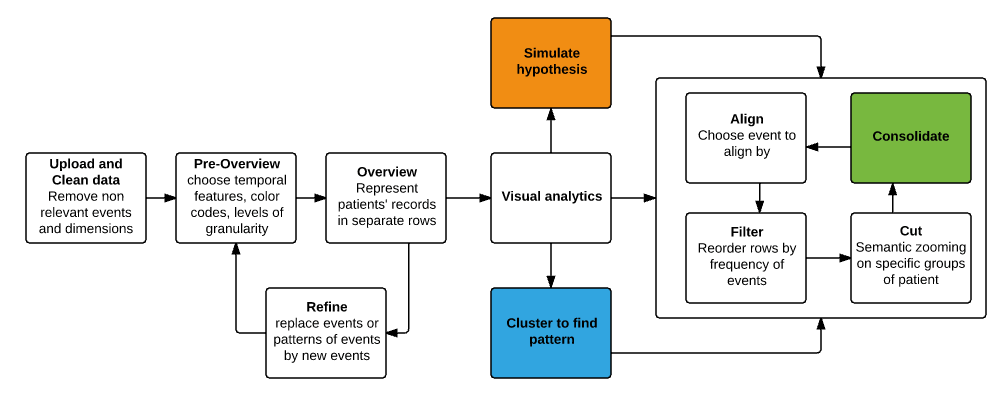

# Predictive-and-visual-analysis-of-Primary-Care-patient-information-

# General Information

In this project we aim to use the EHRs/EMRs collected in a primary care clinic to help making better clinical decisions by bridging the gap between workflow and EHR use and achieving the ‘triple aim’ of healthcare - better care for individuals, better care for all, and greater value for dollars spent. Primary Care is responsible for first contact, continuing, and generalist care of the entire population from birth to death. With increasingly more data being digitally collected in clinical encounters, primary care envisages pioneering integration of clinical care and research. One result of this integration will be the development and application of analytic methods that perform robust analysis and use of computer-based monitoring to track hidden patterns such as uncontrolled problems behaviors. Our aim is three-fold:

- To model a variety of prediction tasks using machine learning techniques applied to EHR data. For that, performance comparisons study of major algorithms such as principal component analysis, SVM, continuous-time Bayes nets and point process models will be done. This will involve two stages, first to consider only the type of events without using the textual content of ToDos and Notes, and second, to use an NLP tool to extract and include the actionable clinical information from the vast amounts of data from encounter’s narratives.

- To create work domain ontology: Primary Care Encounter Ontology. This ontology will guide building and evolving a system suited to the requirements of the workflow in primary practice. The ontology would inevitably model and design a formalized patient-provider interaction, including modeling of subtext of interaction, Questions/ Answers methods, and interaction protocol to mimic the patient-provider experience.

- To visualize multi/across patient data and enable visual analysis methods such as patients’ timeline visualization and patterns and trends discovery.

# Background Information 

Recent advances in predictive analysis in medicine have helped providers make sense of how predictive modeling algorithms fit into population health management. These algorithms identify repeated reliable patterns in data that lend themselves for prediction, rather than fit statistical models that generalize the population. The in-depth research in predictive modeling algorithms have demonstrated a progress in increasing the accuracy of diagnoses and preventing patient-level disease and financial losses leading to increased waste, to cite only few.

Furthermore, the Information design principle “Visual Information-Seeking Mantra : overview first, zoom and filter, then details on demand” proposed by Ben Shneiderman has been successfully applied as a framework for designing information visualization applications. Using on its principle, the core components of our visualization approach are described in the chart bellow. 
 

# Objectives

- Explore considerable data of primary healthcare and provide ground truth information about predictive analysis of selected variables. 

- Provide abstract description of the clinical and cognitive work performed in primary care practice independently from any technology, artifacts, or environmental variables of the clinical settings.

- Develop work domain ontology of primary care practice driven by Goal-Object-Operation-Constraint concepts and allow for top-down and bottom-up reasoning.

- Harness visualization and design guidelines to quickly cognize patients/disease levels. 

- Develop a timeline and visual analytic tool to visually explore temporal data patterns.

# Study Design

# Study Population

- This study draws some already collected patients’ records. No human participants who will be recruited.

# Study Procedures

- No biological specimens are going to be collected or stored.

- This study is an expansion of two ongoing works, one on ontology modeling and reasoning, and the other on timeline visualization and analysis.

- The study will be focused on one objective component of the three objective components at a time.
	
# Data Safety Monitoring
 
This is an information extraction, integration, and analysis study that involves the use of Protected Health Information (PHI) to ensure data integrity. Medical temporal events will be collected from EHRs, and used to generate a database that contains only de-identified data. All data analysis will be performed using only the de-identified database. No data will be disclosed from the study. The access to database will be maintained in a password protected secure server zoned to 100.
Only study personnel will access patient records for this study.  All persons accessing medical records will be required to complete Human Subjects Training if not already completed. No patients will be contacted at anytime. All information on individual patients will be kept confidential. All data forms completed by the annotators will be kept within a locked file cabinet. All data will be destroyed after 6 years.
We anticipate no direct benefits to the human subjects in this study. Indirectly, electronic health records have the potential to support large-scale clinical research studies, and thus the knowledge gained through this project may lead to benefits to the patient population as a whole. Given the minimal risk, we believe that the study is justified and the PI will have responsibility for monitoring throughout the study.
Statistics

We will be applying best practice methods to make sure that the samples used are statistically significant. Methods such as arithmetic mean, standard deviation, and regression models can accurately determine the right sample size of the data set. Other longitudinal methods such as case control studies, cohort studies, and randomized controlled trials will be helpful to provide the assessment for one particular variable in the dataset.

# Ethics

- An IRB approval will be sought from CPHS.
- No new subject will be recruited. No consent will be collected. 

# um,kjData handling and record keeping

•	Data will be kept on its original servers on the primary care clinic and will be made securely queirable from our offices at the school of Biomedical informatics in UTHealth, Houston, TX.
•	Data security under HIPA guidelines and research related ethics will be highly respected by team members.

# Quality control and assurance

•	Machine learning methods, ontology and objectives of visualization will be jointly studied.
•	Intended analysis and experimentations will be regularly discussed between team members.
•	Outcomes and results will be evaluated and compared with the state of the art studies.

Publication Plan

•	We plan to publish our results in dedicated Journals.
•	We plan to attend seminar or conference (at least 1 of each type).
•	Eventually we plan to write a proposal for research grant.

